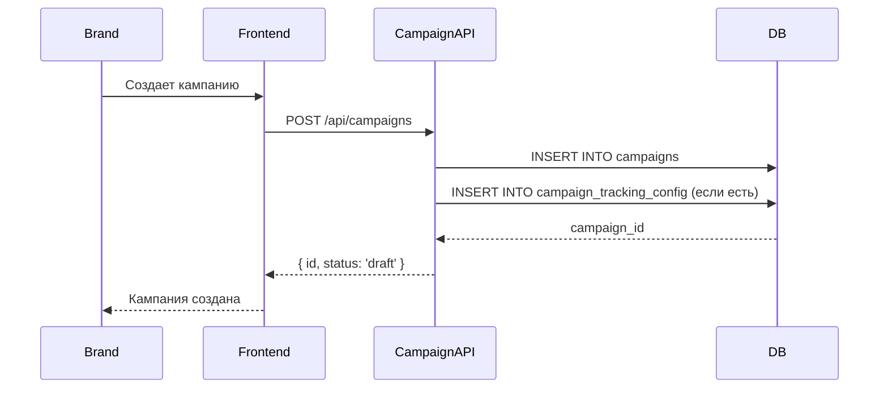
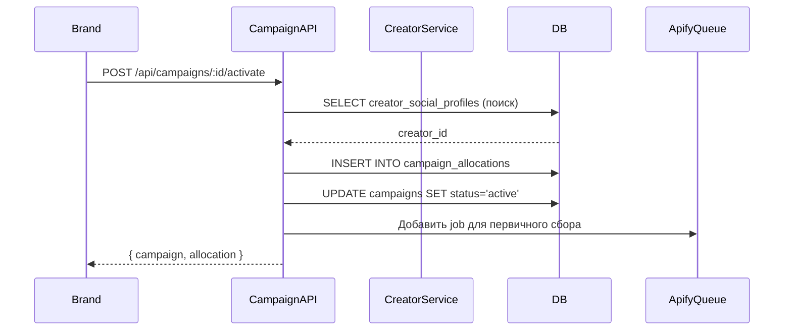
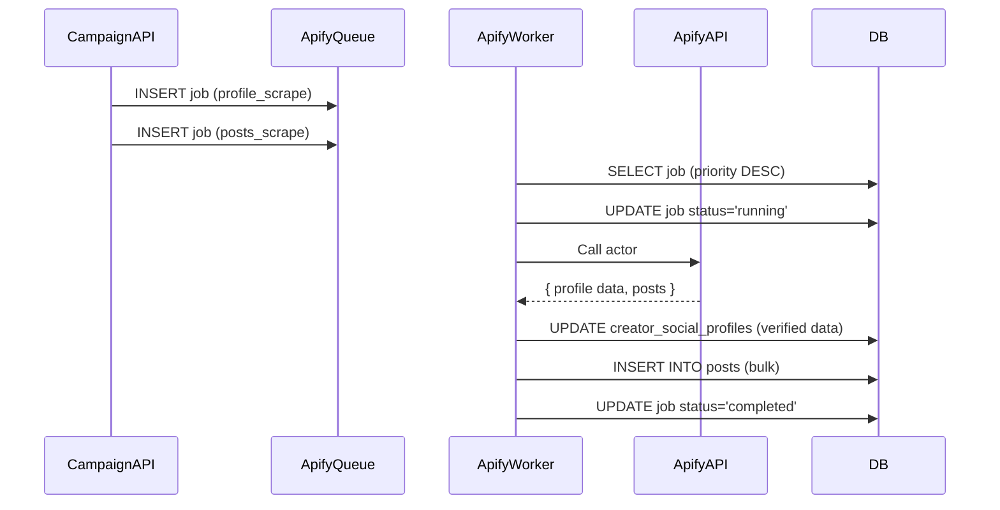
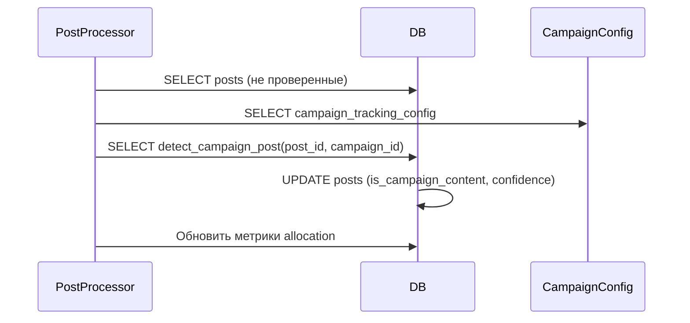
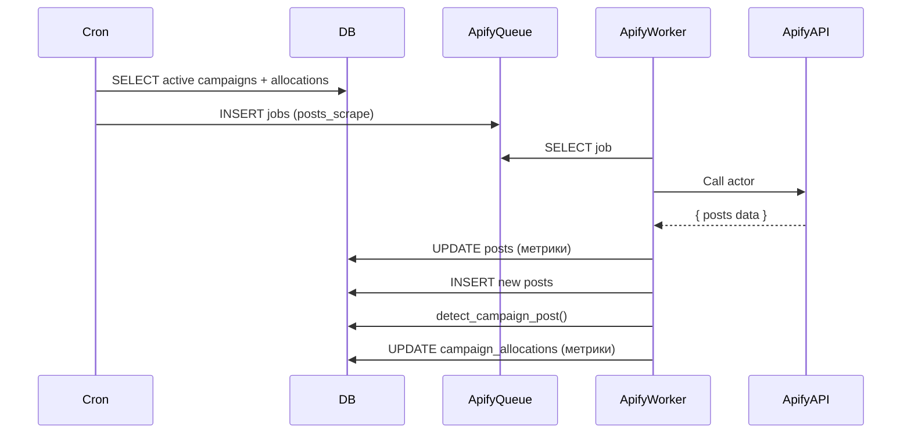
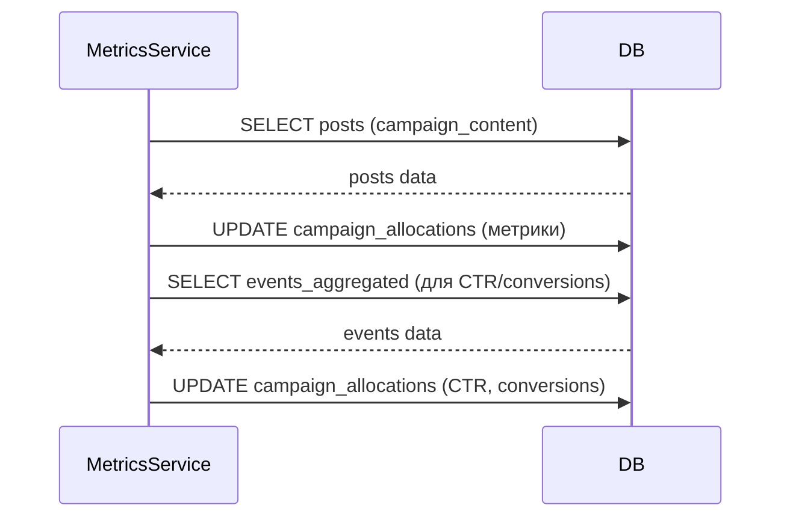
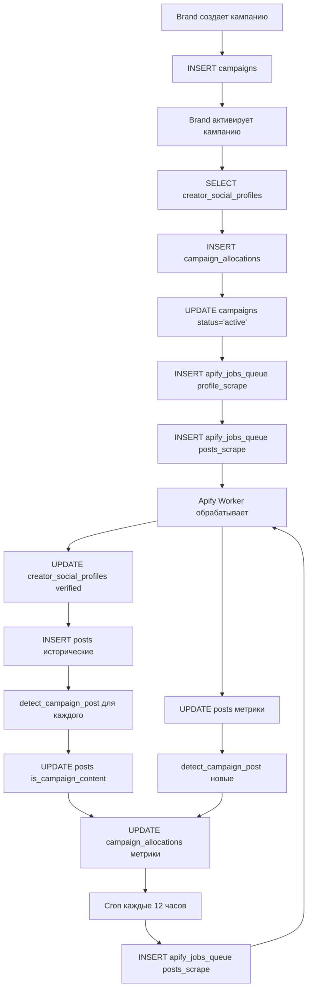

# Campaign Service Flow - MVP

## Обзор

Документация описывает флоу работы с кампанией от создания до сбора статистики. На первом этапе MVP:
- ✅ Создание кампании брендом
- ✅ Выбор креатора из БД (любого подходящего)
- ✅ Первичный сбор данных креатора через Apify
- ✅ Мониторинг постов креатора
- ✅ Сбор метрик (reach, engagement, conversions)
- ❌ Реаллокация бюджета (позже)
- ❌ Выплаты (позже)

## Архитектура

```
Brand → Campaign → Creator Selection → Apify Data Collection → Post Monitoring → Metrics Collection
```

## Этап 1: Создание кампании

### Описание

Бренд создает кампанию через фронтенд, указывая:
- Название, описание
- Бюджет
- Цели (reach, engagement, conversions)
- Платформы (Instagram, TikTok, YouTube)
- Размер аудитории (micro, mid-tier, macro, mega)
- Целевую локацию
- Даты начала/окончания

### Работа с БД

**Таблица: `campaigns`**

```sql
INSERT INTO campaigns (
  id, brand_id, name, description, budget, current_budget,
  goals, target_audience, platforms, audience_size, target_location,
  start_date, end_date, status, created_at, updated_at
)
VALUES (
  gen_random_uuid(),
  $brandId,
  $name,
  $description,
  $budget,  -- в центах
  $budget,  -- current_budget = budget изначально
  ARRAY[$goal1, $goal2],  -- ['reach', 'engagement']
  $targetAudience,
  ARRAY[$platform1, $platform2],  -- ['instagram', 'tiktok']
  $audienceSize,  -- 'micro', 'mid-tier', 'macro', 'mega'
  $targetLocation,
  $startDate,
  $endDate,
  'draft',  -- статус по умолчанию
  now(),
  now()
);
```

**Таблица: `campaign_tracking_config`** (опционально, создается при активации)

```sql
INSERT INTO campaign_tracking_config (
  id, campaign_id, required_hashtags, optional_hashtags,
  required_mentions, tracking_link_pattern, min_match_confidence,
  created_at, updated_at
)
VALUES (
  gen_random_uuid(),
  $campaignId,
  ARRAY[$hashtag1, $hashtag2],  -- например, ['#brandname', '#sponsored']
  ARRAY[$optionalHashtag],
  ARRAY[$mention],  -- например, ['@brandname']
  $trackingLinkPattern,  -- паттерн для tracking links
  0.7,  -- минимальный confidence для auto-detect
  now(),
  now()
);
```

### API Endpoint

```typescript
POST /api/campaigns
Body: {
  name: string;
  description?: string;
  budget: number;  // в центах
  goals: string[];  // ['reach', 'engagement', 'conversions']
  target_audience?: string;
  platforms: string[];  // ['instagram', 'tiktok', 'youtube']
  audience_size?: 'micro' | 'mid-tier' | 'macro' | 'mega';
  target_location?: string;
  start_date: string;  // ISO date
  end_date: string;  // ISO date
  tracking_config?: {
    required_hashtags?: string[];
    optional_hashtags?: string[];
    required_mentions?: string[];
    tracking_link_pattern?: string;
  };
}

Response: {
  id: string;
  status: 'draft';
  // ... остальные поля
}
```

### Sequence Diagram



---

## Этап 2: Активация кампании и выбор креатора

### Описание

После создания кампании бренд активирует её. Система:
1. Ищет подходящих креаторов в БД
2. Выбирает первого подходящего (для MVP)
3. Создает allocation (распределение бюджета)

### Поиск креатора в БД

**Таблица: `creator_social_profiles`**

```sql
SELECT 
  csp.id,
  csp.creator_id,
  csp.platform,
  csp.username,
  csp.followers_actual,  -- computed: COALESCE(followers_verified, followers_declared)
  csp.engagement_rate_actual,  -- computed: COALESCE(engagement_rate_verified, engagement_rate_declared)
  csp.niches,
  csp.location,
  p.status AS creator_status
FROM creator_social_profiles csp
JOIN profile p ON p.id = csp.creator_id
WHERE 
  -- Платформа совпадает
  csp.platform = ANY($campaignPlatforms)  -- ['instagram', 'tiktok']
  
  -- Размер аудитории
  AND (
    ($audienceSize = 'micro' AND csp.followers_actual BETWEEN 1000 AND 10000) OR
    ($audienceSize = 'mid-tier' AND csp.followers_actual BETWEEN 10000 AND 100000) OR
    ($audienceSize = 'macro' AND csp.followers_actual BETWEEN 100000 AND 1000000) OR
    ($audienceSize = 'mega' AND csp.followers_actual > 1000000) OR
    $audienceSize IS NULL
  )
  
  -- Локация (если указана)
  AND ($targetLocation IS NULL OR csp.location ILIKE '%' || $targetLocation || '%')
  
  -- Креатор активен
  AND p.status = 'active'
  
  -- Есть данные (хотя бы declared)
  AND (csp.followers_declared IS NOT NULL OR csp.followers_verified IS NOT NULL)

ORDER BY 
  -- Приоритет: verified данные > declared
  CASE WHEN csp.followers_verified IS NOT NULL THEN 0 ELSE 1 END,
  csp.engagement_rate_actual DESC NULLS LAST
LIMIT 1;  -- Для MVP берем первого
```

### Создание allocation

**Таблица: `campaign_allocations`**

```sql
INSERT INTO campaign_allocations (
  id, campaign_id, creator_id,
  allocated_budget, current_budget,  -- изначально равны
  reach, engagement, conversions, ctr, avg_engagement_rate, posts_count,
  status, created_at, updated_at
)
VALUES (
  gen_random_uuid(),
  $campaignId,
  $creatorId,
  $allocatedBudget,  -- например, весь budget кампании (для MVP 1 креатор = весь budget)
  $allocatedBudget,
  0,  -- начальные метрики = 0
  0,
  0,
  0,
  0,
  0,
  'pending',  -- креатор еще не принял
  now(),
  now()
);
```

### Активация кампании

```sql
UPDATE campaigns
SET 
  status = 'active',
  updated_at = now()
WHERE id = $campaignId;
```

### API Endpoint

```typescript
POST /api/campaigns/:id/activate
Response: {
  campaign: { id, status: 'active' };
  allocation: {
    id: string;
    creator_id: string;
    allocated_budget: number;
    status: 'pending';
  };
}
```

### Sequence Diagram



---

## Этап 3: Первичный сбор данных креатора (Apify)

### Описание

После создания allocation система добавляет задачу в очередь Apify для:
1. Сбора профиля креатора (followers, engagement rate, bio)
2. Сбора исторических постов (последние N постов)

### Добавление задачи в очередь

**Таблица: `apify_jobs_queue`**

```sql
-- Job 1: Сбор профиля
INSERT INTO apify_jobs_queue (
  id, job_type, social_profile_id, campaign_id, allocation_id,
  parameters, priority, status, estimated_cost,
  scheduled_at, created_at
)
VALUES (
  gen_random_uuid(),
  'profile_scrape',
  $socialProfileId,
  $campaignId,
  $allocationId,
  jsonb_build_object(
    'username', $username,
    'platform', $platform,  -- 'instagram', 'tiktok', 'youtube'
    'actorId', $actorId  -- ID Apify actor
  ),
  80,  -- высокий приоритет
  'pending',
  1,  -- 1 API call
  now(),
  now()
);

-- Job 2: Сбор постов
INSERT INTO apify_jobs_queue (
  id, job_type, social_profile_id, campaign_id, allocation_id,
  parameters, priority, status, estimated_cost,
  scheduled_at, created_at
)
VALUES (
  gen_random_uuid(),
  'posts_scrape',
  $socialProfileId,
  $campaignId,
  $allocationId,
  jsonb_build_object(
    'username', $username,
    'platform', $platform,
    'actorId', $actorId,
    'startDate', $campaignStartDate,  -- собираем посты с начала кампании
    'limit', 50  -- последние 50 постов
  ),
  70,  -- средний приоритет
  'pending',
  1,
  now(),
  now()
);
```

### Worker обработки очереди

```typescript
// Worker: process-apify-queue.ts
async function processApifyQueue() {
  // 1. Проверить лимиты
  const canMakeCall = await db.query(
    'SELECT can_make_apify_call($1)',
    [1]
  );
  
  if (!canMakeCall) {
    return; // Ждем следующего цикла
  }
  
  // 2. Взять top job по приоритету
  const job = await db.query(`
    SELECT * FROM apify_jobs_queue
    WHERE status = 'pending'
      AND scheduled_at <= now()
    ORDER BY priority DESC, scheduled_at ASC
    LIMIT 1
    FOR UPDATE SKIP LOCKED
  `);
  
  if (!job) return;
  
  // 3. Обновить статус
  await db.query(
    'UPDATE apify_jobs_queue SET status = $1, started_at = now() WHERE id = $2',
    ['running', job.id]
  );
  
  try {
    // 4. Вызвать Apify API
    const result = await apifyClient.actor(job.parameters.actorId).call(
      job.parameters
    );
    
    // 5. Обновить rate limits
    await updateApifyRateLimits(1, result.cost);
    
    // 6. Обработать результат
    if (job.job_type === 'profile_scrape') {
      await processProfileScrapeResult(job, result);
    } else if (job.job_type === 'posts_scrape') {
      await processPostsScrapeResult(job, result);
    }
    
    // 7. Обновить job
    await db.query(`
      UPDATE apify_jobs_queue
      SET status = 'completed', completed_at = now(), result_data = $1
      WHERE id = $2
    `, [result, job.id]);
    
  } catch (error) {
    await db.query(`
      UPDATE apify_jobs_queue
      SET status = CASE 
        WHEN retry_count < max_retries THEN 'pending'
        ELSE 'failed'
      END,
      retry_count = retry_count + 1,
      error_message = $1
      WHERE id = $2
    `, [error.message, job.id]);
  }
}
```

### Обновление профиля креатора

**Таблица: `creator_social_profiles`**

```sql
UPDATE creator_social_profiles
SET 
  followers_verified = $followersFromApify,
  engagement_rate_verified = $engagementRateFromApify,
  following_count = $followingCount,
  posts_count = $postsCount,
  bio = $bio,
  is_verified = true,
  last_verified_at = now(),
  updated_at = now()
WHERE id = $socialProfileId;
```

### Сохранение постов

**Таблица: `posts`**

```sql
INSERT INTO posts (
  id, creator_id, social_profile_id, campaign_id, allocation_id,
  platform, platform_post_id, url,
  content, text, hashtags, mentions, content_type, media_urls,
  likes, comments, shares, views, engagement_rate, reach, impressions,
  posted_at, timestamp, scraped_at, collected_at,
  last_updated_at, created_at, updated_at, raw_data
)
SELECT 
  gen_random_uuid(),
  $creatorId,
  $socialProfileId,
  $campaignId,
  $allocationId,
  $platform,
  post->>'id',
  post->>'url',
  post->>'caption',
  post->>'caption',
  ARRAY(SELECT jsonb_array_elements_text(post->'hashtags')),
  ARRAY(SELECT jsonb_array_elements_text(post->'mentions')),
  post->>'type',
  post->'media',
  (post->>'likes')::integer,
  (post->>'comments')::integer,
  (post->>'shares')::integer,
  (post->>'views')::integer,
  (post->>'engagement_rate')::numeric,
  (post->>'reach')::integer,
  (post->>'impressions')::integer,
  (post->>'timestamp')::timestamp,
  (post->>'timestamp')::timestamp,
  now(),
  now(),
  now(),
  now(),
  post
FROM jsonb_array_elements($postsArray) AS post
ON CONFLICT (platform, platform_post_id) DO UPDATE SET
  likes = EXCLUDED.likes,
  comments = EXCLUDED.comments,
  shares = EXCLUDED.shares,
  views = EXCLUDED.views,
  engagement_rate = EXCLUDED.engagement_rate,
  reach = EXCLUDED.reach,
  impressions = EXCLUDED.impressions,
  last_updated_at = now(),
  updated_at = now();
```

### Sequence Diagram



---

## Этап 4: Детект campaign posts

### Описание

После сбора постов система определяет, какие посты относятся к кампании, используя:
- Хештеги
- Mentions
- Tracking links
- Функцию `detect_campaign_post()`

### Детект через функцию

**Функция: `detect_campaign_post()`**

```sql
-- Для каждого поста креатора в рамках кампании
SELECT detect_campaign_post(p.id, $campaignId)
FROM posts p
WHERE p.creator_id = $creatorId
  AND p.campaign_id = $campaignId
  AND p.is_campaign_content IS NULL;  -- еще не проверен
```

Функция автоматически:
1. Читает `campaign_tracking_config`
2. Проверяет хештеги, mentions, tracking links
3. Вычисляет confidence score (0-1)
4. Обновляет `posts.is_campaign_content` и `posts.campaign_match_confidence`

### Ручное подтверждение (опционально)

```sql
UPDATE posts
SET 
  is_manually_confirmed = true,
  is_campaign_content = true,
  updated_at = now()
WHERE id = $postId;
```

### Sequence Diagram



---

## Этап 5: Мониторинг постов (периодический)

### Описание

Каждые 12 часов (2 раза в день) система:
1. Собирает новые посты креатора через Apify
2. Обновляет метрики существующих постов
3. Детектит campaign posts
4. Обновляет метрики allocation

### Cron Job

```typescript
// Cron: каждые 12 часов (00:00 и 12:00)
async function monitorCampaignPosts() {
  // 1. Получить активные кампании
  const activeCampaigns = await db.query(`
    SELECT DISTINCT c.id, c.start_date, c.end_date
    FROM campaigns c
    JOIN campaign_allocations ca ON ca.campaign_id = c.id
    WHERE c.status = 'active'
      AND ca.status IN ('accepted', 'active')
      AND now() BETWEEN c.start_date AND c.end_date
  `);
  
  for (const campaign of activeCampaigns) {
    // 2. Для каждой allocation
    const allocations = await db.query(`
      SELECT ca.*, csp.username, csp.platform
      FROM campaign_allocations ca
      JOIN creator_social_profiles csp ON csp.creator_id = ca.creator_id
      WHERE ca.campaign_id = $1
        AND ca.status IN ('accepted', 'active')
    `, [campaign.id]);
    
    for (const allocation of allocations) {
      // 3. Добавить job для обновления постов
      await db.query(`
        INSERT INTO apify_jobs_queue (
          job_type, social_profile_id, campaign_id, allocation_id,
          parameters, priority, status, estimated_cost
        )
        VALUES (
          'posts_scrape',
          $1,
          $2,
          $3,
          jsonb_build_object(
            'username', $4,
            'platform', $5,
            'actorId', $6,
            'startDate', $7,  -- с последнего обновления
            'limit', 20
          ),
          60,  -- средний приоритет
          'pending',
          1
        )
      `, [
        allocation.social_profile_id,
        campaign.id,
        allocation.id,
        allocation.username,
        allocation.platform,
        getApifyActorId(allocation.platform),
        allocation.last_collected_at || campaign.start_date
      ]);
    }
  }
}
```

### Обновление метрик постов

После получения данных от Apify:

```sql
UPDATE posts
SET 
  likes = $newLikes,
  comments = $newComments,
  shares = $newShares,
  views = $newViews,
  engagement_rate = $newEngagementRate,
  reach = $newReach,
  impressions = $newImpressions,
  last_updated_at = now(),
  updated_at = now()
WHERE platform = $platform
  AND platform_post_id = $platformPostId;
```

### Sequence Diagram



---

## Этап 6: Сбор метрик allocation

### Описание

После обновления постов система пересчитывает метрики allocation:
- `reach` — сумма reach всех campaign posts
- `engagement` — сумма (likes + comments + shares) всех campaign posts
- `conversions` — из `events_aggregated` (позже)
- `ctr` — из `events_aggregated` (позже)
- `avg_engagement_rate` — средний engagement rate campaign posts
- `posts_count` — количество campaign posts

### Обновление метрик

**Таблица: `campaign_allocations`**

```sql
UPDATE campaign_allocations
SET 
  -- Reach: сумма reach всех campaign posts
  reach = COALESCE((
    SELECT SUM(reach)
    FROM posts
    WHERE allocation_id = $allocationId
      AND is_campaign_content = true
      AND reach IS NOT NULL
  ), 0),
  
  -- Engagement: сумма (likes + comments + shares)
  engagement = COALESCE((
    SELECT SUM(likes + comments + shares)
    FROM posts
    WHERE allocation_id = $allocationId
      AND is_campaign_content = true
  ), 0),
  
  -- Average engagement rate
  avg_engagement_rate = COALESCE((
    SELECT AVG(engagement_rate)
    FROM posts
    WHERE allocation_id = $allocationId
      AND is_campaign_content = true
      AND engagement_rate > 0
  ), 0),
  
  -- Posts count
  posts_count = (
    SELECT COUNT(*)
    FROM posts
    WHERE allocation_id = $allocationId
      AND is_campaign_content = true
  ),
  
  -- Conversions и CTR из events_aggregated (позже)
  -- conversions = (SELECT SUM(conversions_count) FROM events_aggregated WHERE allocation_id = $allocationId),
  -- ctr = (SELECT AVG(ctr) FROM events_aggregated WHERE allocation_id = $allocationId),
  
  last_collected_at = now(),
  updated_at = now()
WHERE id = $allocationId;
```

### API Endpoint для просмотра метрик

```typescript
GET /api/campaigns/:id/allocations/:allocationId/metrics
Response: {
  allocation_id: string;
  reach: number;
  engagement: number;
  conversions: number;
  ctr: number;
  avg_engagement_rate: number;
  posts_count: number;
  last_collected_at: string;
  posts: Array<{
    id: string;
    url: string;
    likes: number;
    comments: number;
    shares: number;
    engagement_rate: number;
    is_campaign_content: boolean;
    campaign_match_confidence: number;
  }>;
}
```

### Sequence Diagram



---

## Полный флоу (End-to-End)



---

## Таблицы БД в флоу

### Основные таблицы

1. **`campaigns`** — кампании
2. **`campaign_tracking_config`** — правила детекта posts
3. **`campaign_allocations`** — распределение бюджета + метрики
4. **`creator_social_profiles`** — профили креаторов (источник правды)
5. **`posts`** — посты креаторов
6. **`apify_jobs_queue`** — очередь Apify задач
7. **`apify_rate_limits`** — контроль лимитов
8. **`events_raw`** — сырые события (impressions/clicks)
9. **`events_aggregated`** — агрегированные события

### Ключевые поля

**`campaign_allocations`:**
- `reach` — общий охват
- `engagement` — общее вовлечение
- `conversions` — конверсии (из events)
- `ctr` — click-through rate (из events)
- `avg_engagement_rate` — средний ER
- `posts_count` — количество campaign posts
- `last_collected_at` — последнее обновление

**`posts`:**
- `is_campaign_content` — относится ли к кампании
- `campaign_match_confidence` — confidence score (0-1)
- `is_manually_confirmed` — подтверждено вручную

---

## Следующие этапы (Post-MVP)

1. **Event Tracking** — сбор impressions/clicks через UTM
2. **Реаллокация бюджета** — формула на основе метрик
3. **Выплаты** — Stripe Connect
4. **Множественные креаторы** — распределение бюджета между несколькими
5. **AI Matching** — умный подбор креаторов

---

## API Endpoints Summary

```
POST   /api/campaigns                          # Создать кампанию
GET    /api/campaigns                          # Список кампаний
GET    /api/campaigns/:id                      # Детали кампании
POST   /api/campaigns/:id/activate              # Активировать + выбрать креатора
GET    /api/campaigns/:id/allocations          # Список allocations
GET    /api/campaigns/:id/allocations/:allocationId/metrics  # Метрики allocation
GET    /api/campaigns/:id/allocations/:allocationId/posts     # Посты allocation
POST   /api/posts/:id/confirm                  # Подтвердить post вручную
```

---

## Важные замечания

1. **Computed columns** (`followers_actual`, `engagement_rate_actual`) создаются через миграцию SQL
2. **Партиционирование** (`posts`, `events_raw`) настраивается через миграцию SQL
3. **Функции** (`detect_campaign_post`, `can_make_apify_call`) создаются через миграцию SQL
4. **Cron jobs** настраиваются через pg_cron или внешний scheduler
5. **Apify Worker** запускается как отдельный процесс/сервис

