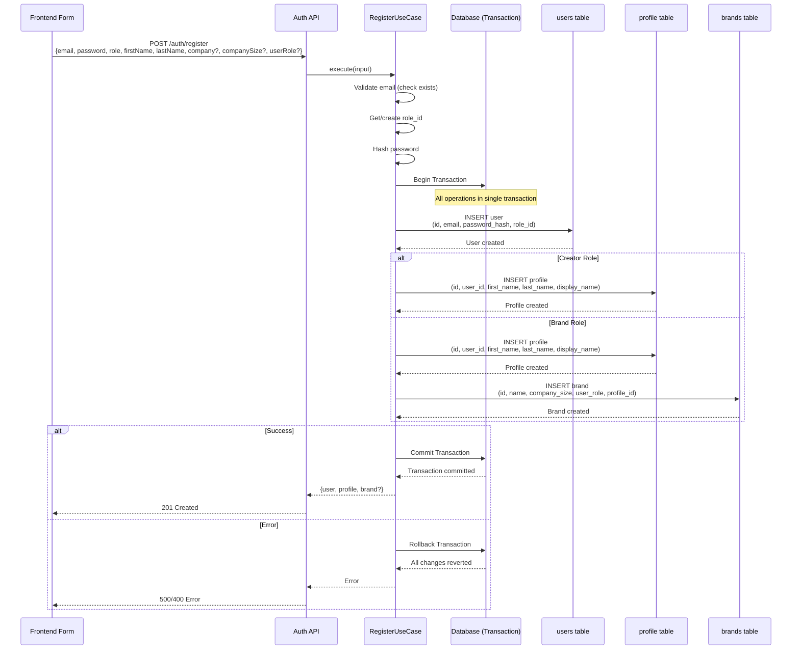
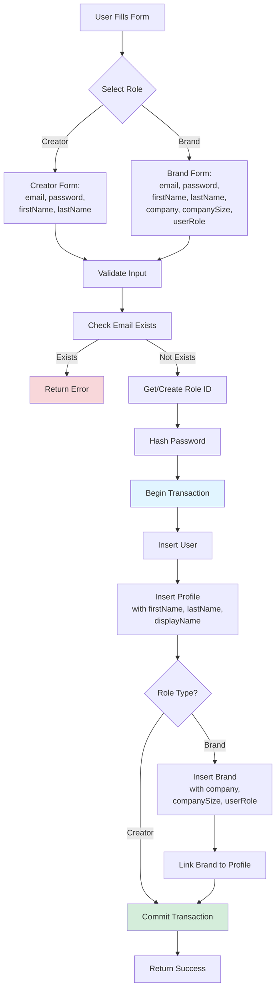

# Registration Flow Documentation

## Overview

Registration process saves all user information from the signup form in a single database transaction to ensure data consistency.

## Database Schema

### Profile Table
Stores user profile information for both creators and brands:

```sql
profile (
  id UUID PRIMARY KEY,
  user_id UUID UNIQUE NOT NULL, -- FK to users
  first_name TEXT,              -- From registration form
  last_name TEXT,                -- From registration form
  display_name TEXT,             -- Computed: "firstName lastName" or null
  bio TEXT,
  avatar_url TEXT,
  status VARCHAR(20),            -- active, pending, suspended
  created_at TIMESTAMP,
  updated_at TIMESTAMP
)
```

### Brands Table
Stores brand/company information (only for brand role):

```sql
brands (
  id UUID PRIMARY KEY,
  name TEXT NOT NULL,           -- Company name from form
  description TEXT,
  website_url TEXT,
  logo_url TEXT,
  brand_type VARCHAR(20),        -- agency, direct, platform
  company_size VARCHAR(20),      -- 1-10, 11-50, 51-200, 201-1000, 1000+
  user_role VARCHAR(50),         -- marketing-manager, marketing-director, etc.
  profile_id UUID,               -- FK to profile (optional)
  created_at TIMESTAMP,
  updated_at TIMESTAMP
)
```

## Registration Flow

### For Creator
1. User fills: email, password, firstName, lastName
2. System creates: user → profile (with firstName, lastName, displayName)

### For Brand
1. User fills: email, password, firstName, lastName, company, companySize, userRole
2. System creates: user → profile (with firstName, lastName, displayName) → brand (with company, companySize, userRole)

## Transaction Logic

All database operations happen in a single transaction:

```typescript
db.transaction(async (tx) => {
  // 1. Create user
  // 2. Create profile
  // 3. If brand: create brand record
  // If any step fails, entire transaction rolls back
})
```

## Mermaid Diagram



## Data Flow Diagram



## API Request/Response

### Request (Creator)
```json
{
  "email": "creator@example.com",
  "password": "password123",
  "role": "creator",
  "firstName": "John",
  "lastName": "Doe"
}
```

### Response (Creator)
```json
{
  "user": {
    "id": "uuid",
    "email": "creator@example.com",
    "role": "creator"
  },
  "profile": {
    "id": "uuid",
    "status": "pending"
  }
}
```

### Request (Brand)
```json
{
  "email": "brand@example.com",
  "password": "password123",
  "role": "brand",
  "firstName": "Jane",
  "lastName": "Smith",
  "company": "Acme Corp",
  "companySize": "51-200",
  "userRole": "marketing-manager"
}
```

### Response (Brand)
```json
{
  "user": {
    "id": "uuid",
    "email": "brand@example.com",
    "role": "brand"
  },
  "profile": {
    "id": "uuid",
    "status": "pending"
  },
  "brand": {
    "id": "uuid",
    "name": "Acme Corp"
  }
}
```

## Error Handling

- **Email already exists**: Transaction not started, returns 409
- **Database error during transaction**: All changes rolled back, returns 500
- **Validation error**: Transaction not started, returns 400

## Migration Required

Add columns to existing tables:

```sql
-- Add to profile table
ALTER TABLE profile ADD COLUMN IF NOT EXISTS first_name TEXT;
ALTER TABLE profile ADD COLUMN IF NOT EXISTS last_name TEXT;

-- Add to brands table
ALTER TABLE brands ADD COLUMN IF NOT EXISTS company_size VARCHAR(20);
ALTER TABLE brands ADD COLUMN IF NOT EXISTS user_role VARCHAR(50);
```

