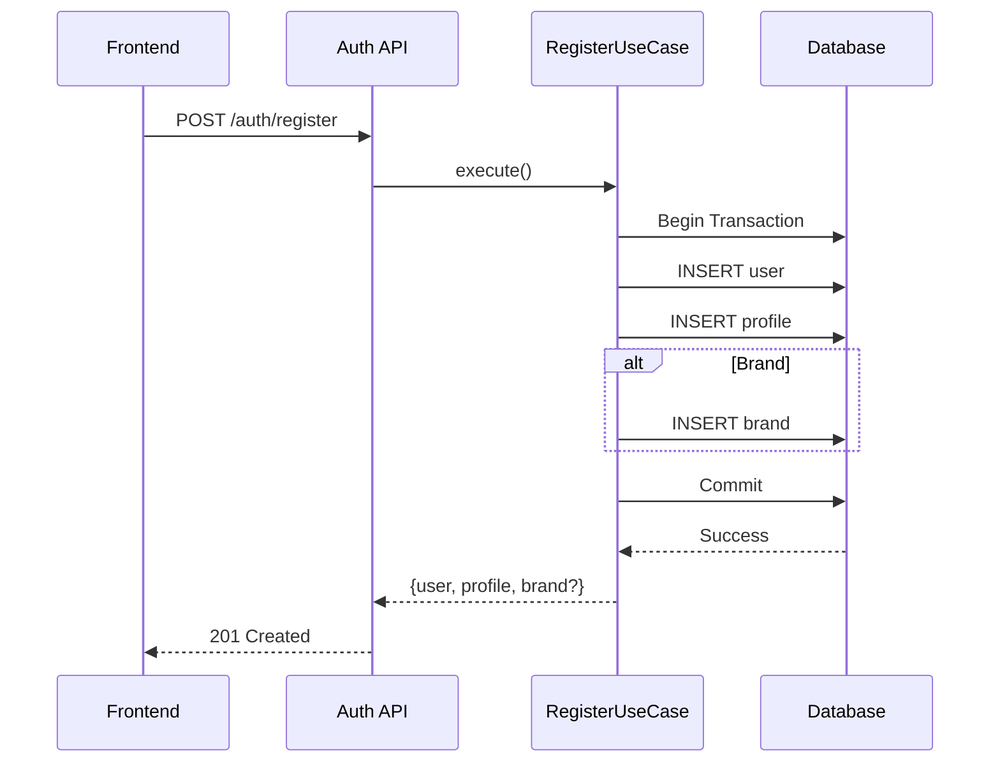

# Registration Flow

## Flow

**Creator**: email, password, firstName, lastName → user → profile

**Brand**: email, password, firstName, lastName, company, companySize, userRole → user → profile → brand

## Transaction

All operations in a single transaction: user → profile → brand (if brand). On error - rollback.

## Sequence Diagram



## API

**Request (Creator)**
```json
{
  "email": "creator@example.com",
  "password": "password123",
  "role": "creator",
  "firstName": "John",
  "lastName": "Doe"
}
```

**Request (Brand)**
```json
{
  "email": "brand@example.com",
  "password": "password123",
  "role": "brand",
  "firstName": "Jane",
  "lastName": "Smith",
  "company": "Acme Corp",
  "companySize": "51-200",
  "userRole": "marketing-manager"
}
```

## Errors

- Email exists → 409
- Validation error → 400
- DB error → 500 (rollback)

